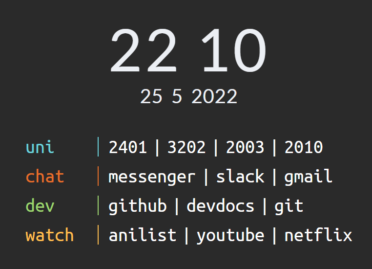

# the site itself

Before we get started, the story is not that interesting. 
I'm also not very good at remembering things once they've passed.
Still, we'll do our best.

## prologue

Sometime in my undergraduate career, it was decided that I needed a personal website.
The git logs say this was circa August 2018. 
Besides GitHub's Jekyll template, the first thing on there was a page about a userscript I made. 
The script was a small window to search Blackboard, the university's content management system [^1].
A few months later, I blew all this away (this will be a recurring theme).

The next item was a version of the [Tilde](https://github.com/xvvvyz/tilde) start page. 
Our version looked like this:



This went on for a while (there are entirely too many commits).

A few other projects went up. One was a HTML viewer for the Atmel AVR ISA.
I imagine I became tired of Jekyll and its oddities, 
and a hand-written Python templater was made and used to create the site. 
It used some kind of expression (likely regular) to edit the HTML in-place
which was quite convenient. 
It only worked with one page, though. 
With this, we wrote some LaTeX documents and put them up.

I found React sometime near the end of 2019 and made a couple of those, 
though they were hosted somewhere else. 
Around the same time, it was rewritten to use Bulma (still using the Python template though!).

This is version is still up now (and will probably stay there). 
The year in the footer is 2020 and there's a questionable gradient in the header.

## rina.fyi I

As part of a _rebranding_ effort, we went looking for a fun new domain
with one goal in mind: it had to be short. The fewer letters, the better.

Months of searching Porkbun gave us httpsrina.fyi. 
It went unused for a good while before we pushed a site using _Hakyll_[^2].

Hakyll (and Haskell in general) is great at defining programs as pure transformations.
This is a natural way of processing input files and building pages.

Unfortunately, Hakyll came with a cost and that cost was compile time. 
Not of the site, mind you, but of Hakyll itself. 
I'd written an article, you see, and I had to share it with the world!
But Hakyll wasn't installed. Since the last time we touched the site, I'd gotten
a new laptop (several times!).
Compiling Hakyll and its prerequisites from source took upwards of half an hour.
This was time spent imagining how much faster it could be.

This led to a terrible idea: using Python.

## rina.fyi II

I have something of a reluctant competence with Python. 
It's stuck with me for longer than I would like, simply because there's nothing
out there to replace it. 

Anyway, the idea was simple. We would write a super basic site generator using Python. 
_How hard could it be?_

All it needs to do is ship Markdown to Pandoc then stitch pages together with 
some kind of template. It could be fast and portable, with no compile times to
speak of! This was our first mistake.

It turns out that every line of Python written causes _emotional damage_. 
Our goal was to have filter rules using glob patterns and process using sequences
of composed steps. Except the steps would be impure, but we accepted that.
It was the price we pay for using Python.

The first milestone was Pandoc compilation. This was already not going well.
To get the table of contents and other metadata, we dumped it to stdout and parsed it.
Even beyond that, it was causing problems since we used a `Dict[str,Any]` to store it.
But we keep at it!

Next we needed templating. Mako was the library we chose because it let us use 
Python in templates, which seemed great. Still, code like this with the completely
non-specific data would inevitably cause problems.
```python
def Mako(t: str) -> PageTransform:
    template = Template(filename=t, output_encoding='utf-8')

    def apply(p: Page) -> Page:
        kwargs = p.__dict__ | p.meta
        p.data = cast(bytes, template.render(**kwargs))
        print(p.data)
        return p
    return apply 
```

After this we barely uploaded a version of the post and sent it out to the world
wide web. But I was exhausted.

Programming is only possible because of mental models. 
Programming languages should help you organise these and help you check that
your model matches what is really happening and reconcile it if it doesn't.
Python is especially poor at this. 

The cost of mutating and passing object references around was too much. 
It was too much for me to keep in the head, but I knew just enough that
it would cause problems. That made me _deeply uncomfortable_. 
On top of all that, Python's syntax leans heavily to OOP which doubled the work
needed and limited the abstractions we could use or make[^3].

It became obvious that any further work would at great mental and emotional cost.
We return to Haskell.

## rina.fyi III

After all, 30 minutes of compile time is a small price to pay for salvation.

We went crawling back to Hakyll and endured the compile. 
Once compiled, it was very easy to make a basic configuration. 
Its built in Pandoc integration (since Pandoc is also Haskell!) and templating
meant the problems we had in Python were already solved. 
In about a day we had matched the functionality of the Python code, 
with much less code that makes me want to cry.


What's more, it was easy and practical to build on top of. 
One enhancement was taking the structure from the directory and using that
to generate lists of posts and subfolders. 
This was easy with its automatic dependency tracking and resolution. 
The generic function to do this is here:
```haskell
-- from src/Dir.hs
dir :: FilePath -> Context String -> (Item String -> Compiler (Item String)) -> (Item String -> Compiler (Item String)) -> Rules ()
dir p c indexCont postCont = do
  match (p /**?/ "index.md") $ 
    do
      route $ setExtension "html"
      compile $ 
        do
          (files, dirs, both) <- loadAdj =<< getUnderlying
          lists <- fold <$> sequence [sortOptions c "files" files, sortOptions c "dirs" dirs, sortOptions c "both" both]
          getResourceBody 
            >>= applyAsTemplate (lists <> c)
            >>= indexCont
  match (p /**?/ "*.md") $
    do
      route $ setExtension "html"
      compile $ getResourceBody 
        >>= postCont
```
Isn't it beautiful? Look at those sequences and custom operators. Wonderful! 
For each index.md page it finds, it lists all files and subfolders and passes them off to the template.

The most exciting thing here is the indexCont and postCont _continuations_. 
Here is an example of how `dir` is used:
```haskell
indexCont = doPandoc
  >=> loadAndApplyTemplate "templates/default.html" context
postCont = doPandoc
  >=> loadAndApplyTemplate "templates/post.html" context
  >=> loadAndApplyTemplate "templates/default.html" context

main :: IO ()
main = hakyllWith config $
  do
    dir "p" context indexCont postCont
    dir "b" context indexCont postCont
```

Do you see that `>=>` fish, dear reader? Do you see it?! 
This is the [Kleisli composition](https://hackage.haskell.org/package/base-4.16.1.0/docs/Control-Monad.html#v:-62--61--62-)
operator. 
What it does is it lets us compose _monadic actions_ analagously to ordinary function composition.
Compare the flipped `<=<` version to the `.` operator:
```haskell
(.)   ::            (b ->   c) -> (a ->   b) -> a ->   c
(<=<) :: Monad m => (b -> m c) -> (a -> m b) -> a -> m c
```
(Clearly, I am very excited to use this in a "real" "project"!)

We need this because the Compiler is a monad, which gives us a whole suite of other tools to use
(`sequence` above was one of them!).

This was, surprisingly, a great deal of fun and in great contrast to the Python experience[^4]. 
Being able to mentally reason about your work is a vital part of building bigger things.
The promise of purity lets us effortlessly work at different scales of abstraction with
faith (and type guarantees) that it will all work together.

## epilogue (?)

It was, also surprisingly, fun to recount the journey. 
I found that the process of writing each section echeod the experience at the time
(Python was especially painful. I wonder how obvious that is.). 
Writing is so strange to me.

Anyway, it is my hope and my expectation that this latest incarnation will last into
the forseeable future. 
It was definitely helpful to get this insight into my goals and needs when working with code.


<!-- ### epi-epilogue -->

<!-- This was longer than I thought it'd be.  -->
<!-- It probably doesn't need to be so long (the old website is especially uninteresting). -->
<!-- Writing is so strange to me. -->

[^1]: 
Unfortunately, this was my first real adventure into Javascript and it was 994 lines of 
mess---impossible to maintain and I've barely touched it since then.

[^2]: The time gap before this is quite large and lots of things changed.
Haskell was a recent and intense fascination.

[^3]: Python's god-awful `lambda x:` syntax is one of my biggest complaints. 
Not only is it v e r b o s e, it also only supports expressions which makes it impossible
to write anything mildly-non-trivial. Gah!

[^4]: That said, there was still some funny business. Particularly around Hakyll's handling
of _Context_ for templates, some ambiguities in its dependency resolution, and inconveniences
with its template syntax. 